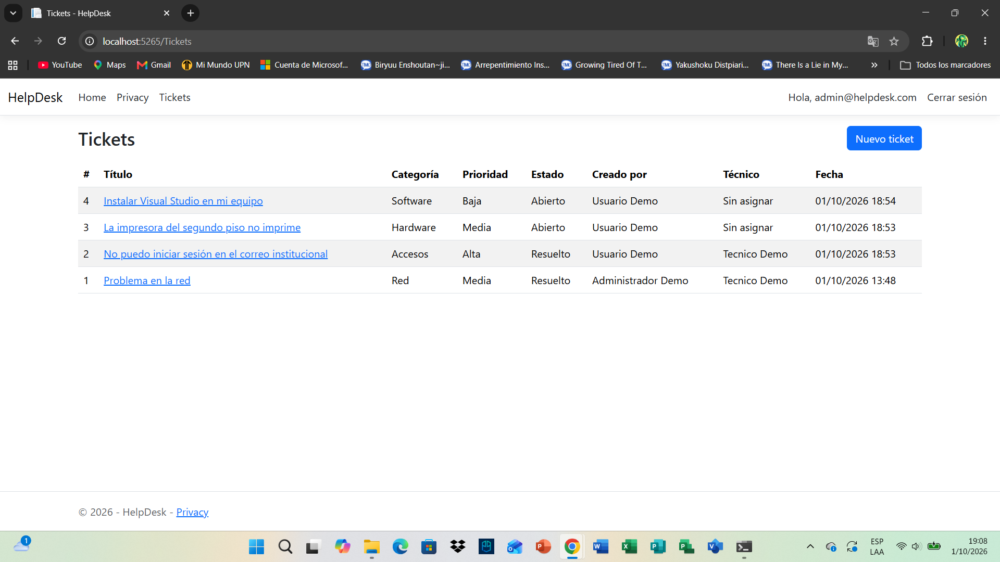
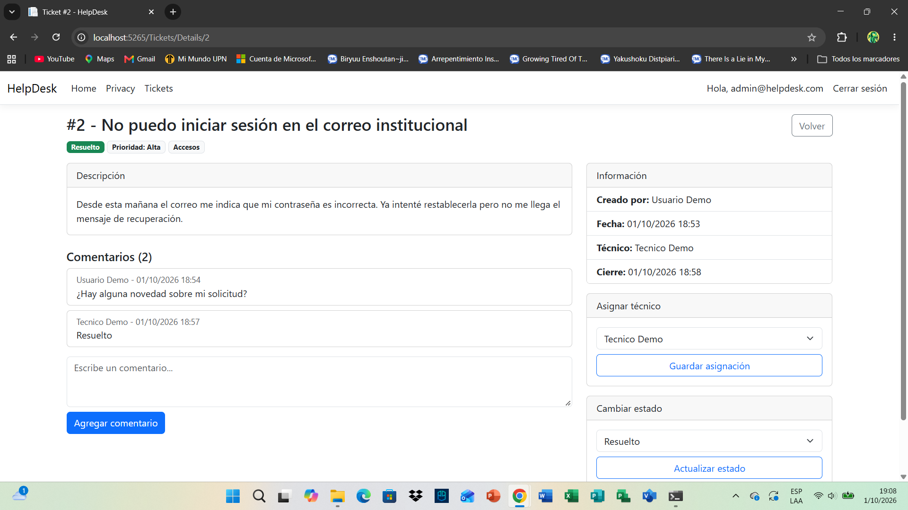
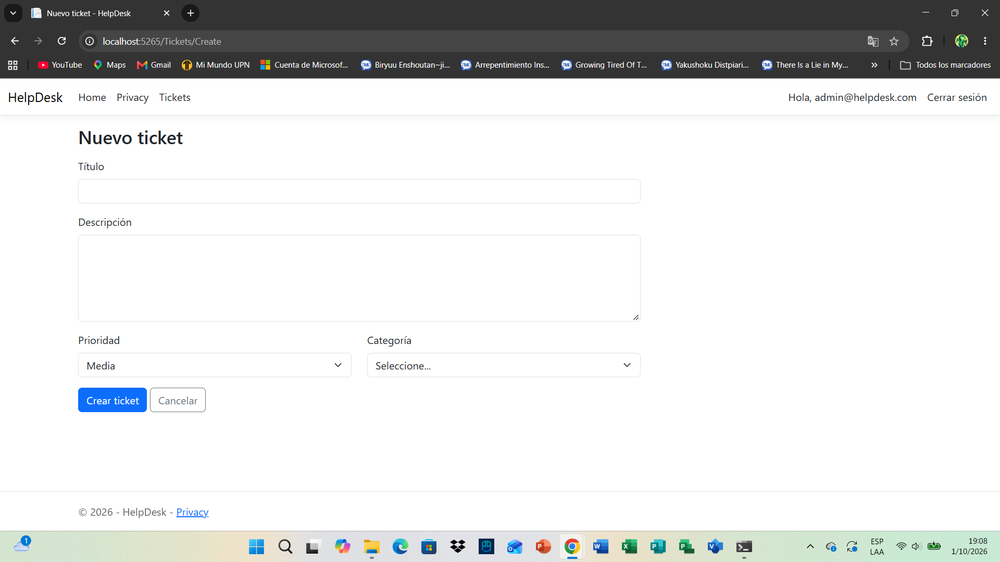

# HelpDesk - Sistema de tickets de soporte técnico

Aplicación web para gestionar solicitudes de soporte técnico con tres roles (usuario, técnico y administrador), desarrollada con ASP.NET Core MVC, Entity Framework Core y SQL Server. Proyecto personal para practicar autenticación, autorización por roles y acceso a datos.

## Funcionalidades

- Inicio de sesión y registro con ASP.NET Core Identity, con tres roles: `Administrador`, `Tecnico` y `Usuario`.

- Los usuarios crean tickets con título, descripción, prioridad (baja, media, alta, crítica) y categoría (Hardware, Software, Red, Accesos).

- El administrador ve todos los tickets y asigna un técnico a cada uno.

- El técnico puede tomar tickets sin asignar y cambiar su estado: Abierto, En proceso, Resuelto o Cerrado. Al resolver o cerrar se registra la fecha de cierre.

- Cada ticket tiene comentarios con el autor y la fecha.

- Cada rol solo accede a los tickets que le corresponden. Si un usuario intenta abrir un ticket ajeno escribiendo la dirección, el acceso se deniega.

## Tecnologías

- ASP.NET Core MVC (.NET 10)

- Entity Framework Core (Code First y migraciones)

- SQL Server (LocalDB)

- ASP.NET Core Identity con roles

- Bootstrap

- Git y GitHub

## Capturas

## Cómo ejecutarlo

Requisitos: SDK de .NET 10, SQL Server LocalDB (viene con Visual Studio) y Git.

&#x20;   git clone https://github.com/FabrizioSuncion/helpdesk-aspnet-core.git

&#x20;   cd helpdesk-aspnet-core

&#x20;   dotnet tool install --global dotnet-ef

&#x20;   dotnet ef database update

&#x20;   dotnet run

Abre en el navegador la dirección que aparece en la consola (por defecto `http://localhost:5265`). La cadena de conexión está en `appsettings.json` y apunta a `(localdb)\MSSQLLocalDB`.

Al iniciar, la aplicación crea los roles y tres usuarios de prueba (solo para entorno local):

| Rol | Correo | Contraseña |

|---|---|---|

| Administrador | admin@helpdesk.com | Admin123 |

| Técnico | tecnico@helpdesk.com | Tecnico123 |

| Usuario | usuario@helpdesk.com | Usuario123 |

## Permisos por rol

| Acción | Usuario | Técnico | Administrador |

|---|---|---|---|

| Crear tickets | Sí | Sí | Sí |

| Ver tickets | Solo los suyos | Los asignados a él y los sin asignar | Todos |

| Tomar un ticket sin asignar | No | Sí | No |

| Asignar técnico | No | No | Sí |

| Cambiar estado | No | Solo en sus tickets | Sí |

| Comentar | En los que puede ver | En los que puede ver | Sí |

## Estructura del proyecto

- `Controllers/TicketsController.cs`: lógica de tickets, permisos y comentarios.

- `Models/`: entidades (`Ticket`, `Categoria`, `Comentario`, `ApplicationUser`) y modelos de vista.

- `Data/`: contexto de Entity Framework y datos iniciales (roles y usuarios de prueba).

- `Views/Tickets/`: pantallas de listado, creación y detalle.

- `Migrations/`: migraciones de la base de datos.

## Próximas mejoras

- Panel con estadísticas (tickets por estado, prioridad y tiempo promedio de resolución).

- Filtros y búsqueda en la lista de tickets.

- Notificaciones por correo al asignar o resolver un ticket.

- Pruebas unitarias del controlador.

## Autor

Fabrizio Suncion - estudiante de Ingeniería de Sistemas Computacionales (UPN).

